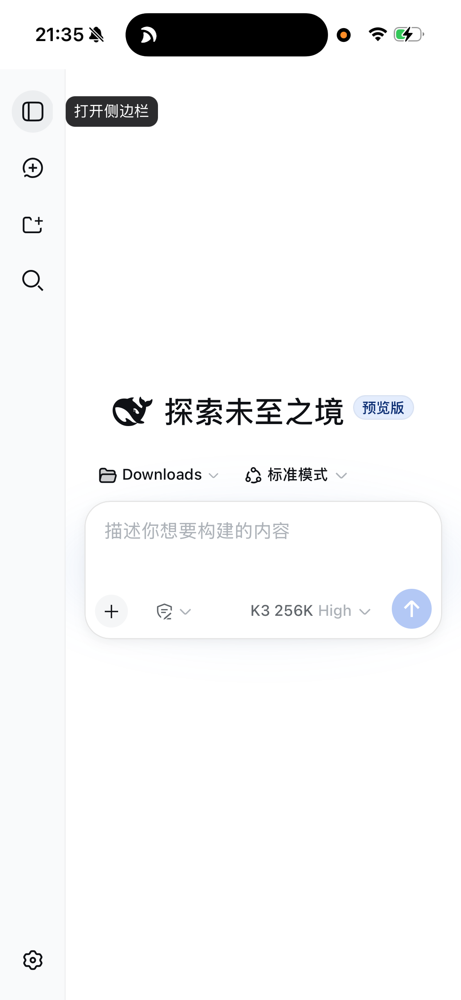
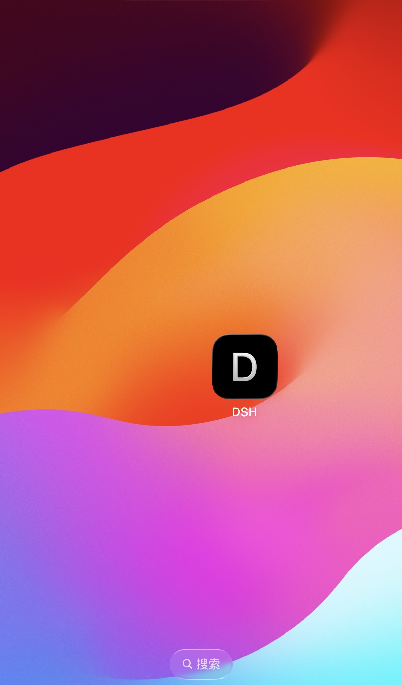

# dsh-phone-remote

**English** | [简体中文](README.zh-CN.md)

Use **DeepSeek Harness (DSH)** from your phone — like Claude Code's remote control: send messages, watch the agent work in real time, and approve actions while away from your desk.

- 💰 Zero cost (Cloudflare free quick tunnel)
- 📱 **No app, no VPN** on the phone — iPhone and Android work identically (and it won't fight proxy apps for iPhone's single VPN slot)
- 💻 Host side: **macOS / Linux / Windows**
- 🔒 Built-in password gate (DSH has no login mechanism — exposing it bare would be public remote code execution)
- 🔄 Auto-restart: survives reboots and crashes
- 🧩 Generic: point `upstream` at any local web app and the same recipe applies

## Quick start: let your DSH install it for you ⚡

Already running DSH on your computer? Don't even open a terminal — paste this into your DSH chat (default address http://127.0.0.1:3080 — if you launch with a custom `--port`, use yours):

> Help me set up phone remote access. Clone https://github.com/Junfei-Z/dsh-phone-remote locally, read its README, run the installer for my OS (`install.sh` on macOS, `install-linux.sh` on Linux), then give me the phone URL and access password.

DSH will clone, install dependencies, configure the services, and hand you the **URL and password** — you just open it on your phone. 🤯

(Windows: ask DSH to read `windows/start-dsh-remote.ps1` and run it for you.)

## What you get

```
phone browser → https://xxx.trycloudflare.com → password once → full DSH GUI
(messages / live output / tool approvals / auto-reconnect / add to home screen)
```

<p align="center">
  
  &nbsp;&nbsp;
  
</p>

<i align="center">Left: the full DSH console on an iPhone. Right: added to the home screen, it behaves like an app.</i>

## Platform support

| Setup | Status |
|---|---|
| Mac → iPhone | ✅ one-command (`install.sh`) |
| Mac → Android | ✅ same script (phone steps are identical) |
| Linux → any phone | ✅ one-command (`install-linux.sh`, systemd user services) |
| Windows → any phone | ⚠️ semi-automatic (`windows/start-dsh-remote.ps1`; PRs welcome) |

**The phone side is identical everywhere**: open the URL in a browser (Safari on iPhone, Chrome on Android), enter the password, add to home screen.

## Why DSH isn't remotely reachable by default — and how this fixes it

`dsh web` serves the GUI on `127.0.0.1:3080` only, and `--host 0.0.0.0` is deliberately refused — the GUI can execute code on your machine yet **has no built-in accounts**. It does ship a "browser-trust fence" (Host/Origin checks against DNS rebinding and CSRF), but that's attack defense, not authentication.

So "phone access" is three independent problems, each with one fix:

```
┌────────────┐   HTTPS   ┌──────────────┐ tunnel(outbound) ┌───────────────────────────────┐
│   phone    │ ────────→ │  Cloudflare  │ ───────────────→ │ your computer (no public IP /  │
│  browser   │           │  edge        │                  │ no router changes needed)      │
└────────────┘           └──────────────┘                  │  ③ dsh-auth-proxy :8443        │
                                                           │   password + cookie + ratelimit│
                                                           │   ↓ rewrite Host / strip Origin│
                                                           │  ② dsh web :127.0.0.1:3080     │
                                                           │   fence sees a local request   │
                                                           └───────────────────────────────┘
```

1. **Networking** — `cloudflared` builds an encrypted tunnel *outbound* from your computer to Cloudflare. No public IP, no router changes, HTTPS included. Official builds for every platform.
2. **Authentication** — a ~200-line, zero-dependency Node gate (`proxy/dsh-auth-proxy.mjs`) sits between the tunnel and DSH: no password, no entry; a signed 180-day cookie after login; 8 wrong passwords locks the IP for 5 minutes. Cross-platform.
3. **Fence compatibility** — the gate rewrites `Host` to `127.0.0.1:3080` and strips `Origin`, so DSH's fence sees a loopback request. **Zero changes to DSH itself.**

Only the auto-start layer is OS-specific: launchd on macOS, systemd on Linux, Task Scheduler/startup folder on Windows.

## Manual install

Prerequisites: DSH working (`npm exec @deepseek-ai/dsh web`), Node.js.

### macOS

```zsh
git clone https://github.com/Junfei-Z/dsh-phone-remote.git
cd dsh-phone-remote
./install.sh        # auto-installs cloudflared via Homebrew if missing
```

### Linux

```bash
git clone https://github.com/Junfei-Z/dsh-phone-remote.git
cd dsh-phone-remote
./install-linux.sh  # cloudflared must be installed first (script prints the link)
```

Uses systemd user services; for start-at-boot without login: `sudo loginctl enable-linger $USER`.

### Windows (semi-automatic)

```powershell
git clone https://github.com/Junfei-Z/dsh-phone-remote.git
cd dsh-phone-remote
powershell -ExecutionPolicy Bypass -File .\windows\start-dsh-remote.ps1
```

Auto-start (either): drop a shortcut to the script into `shell:startup`, or use the `schtasks` command from the Chinese README.

> The Windows path is not machine-tested — issues and PRs welcome.

## Phone side (iPhone / Android identical)

1. Open the printed URL in your browser
2. Enter the access password (once per 180 days)
3. Share/menu → **Add to Home Screen** → tap the icon from now on

## Optional: a stable URL

Quick-tunnel URLs change when the computer restarts (the current one is always in `~/.dsh/remote-url.txt`). For a fixed hostname:

1. Buy any domain and host it on Cloudflare (free plan works)
2. Cloudflare Zero Trust → Networks → Tunnels → create a tunnel, point the Public Hostname at `http://localhost:8443`
3. Optionally add a Cloudflare Access application (email OTP), or keep this repo's password gate
4. Run the tunnel the official persistent way: `cloudflared service install <token>`

## FAQ

**Is it secure?** The public internet can only reach the password gate; DSH itself stays on 127.0.0.1. Everything is HTTPS. The password lives in `~/.dsh/remote-auth.json` — edit the `password` field to rotate it. Never expose DSH without authentication (bare `--host 0.0.0.0` or an unauthenticated tunnel).

**Why not Tailscale?** Tailscale is great (private mesh), but an iPhone can only run one VPN tunnel at a time — if you use proxy apps, they conflict. This approach is "just a URL" on the phone: zero conflicts.

**Mac lid closed / asleep?** The macOS package includes a `caffeinate -s` service: no sleep on AC power, automatically inactive on battery.

**Uninstall**: macOS `./uninstall.sh`; Linux `systemctl --user disable --now dsh-auth-proxy dsh-cloudflared dsh-web` and remove `~/.config/systemd/user/dsh-*`.

## Files

| Path | Role |
|---|---|
| `proxy/dsh-auth-proxy.mjs` | password gate (zero-dependency Node, cross-platform) |
| `scripts/dsh-web.sh` | DSH GUI launcher (waits for port handoff) |
| `scripts/dsh-cloudflared.sh` | tunnel wrapper (records the assigned URL) |
| `launchd/*.plist` | macOS service templates |
| `systemd/*.service` | Linux service templates |
| `windows/start-dsh-remote.ps1` | Windows starter |
| `install.sh` / `install-linux.sh` / `uninstall.sh` | installers |

## License

MIT
